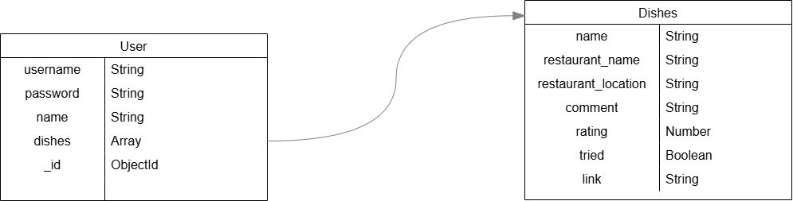

# 🍽 DishNote
DineNote is a dish tracking app that let everyone log, explore, and share their culinary experiences. Discover new dishes from other users' lists and get inspired by their food journeys.

[DishNote Deployment here!](https://dish-tracker-56e951c2fd28.herokuapp.com/)

## Techstack
- Node.js + Express
- MongoDB + Mongoose
- EJS templating
- HTML/CSS/JS

## App Description to use
Users are able to input:
* Dish Name
* Restaurant Name
* Restaurant Location
* Website Link
* Notes
* Status (Tried/Want to Try)

Users have the ability to:
* Add New Dish
* Edit Existing Dish
* Delete Existing Dish from their collection

Users can also visit the "Explore our Community" page where they can view our members and click to see other members' dishes collection.

## Planning 
### Wireframes and Data Mode

[Planning Materials: Trello Board](https://trello.com/b/ImVQlfdW/project-2-dishtracker)

Data Model:

## Attributions
- background image from [pixabay](https://pixabay.com/)
- favicon from [favicon.io/](https://favicon.io/)

## Next Steps
* members can upload their dish picture
* a search bar to search for information already existing in the database
* able to "like"/ save other member's dish
* able to add other member as "friend"/ following other members
* message feature between members